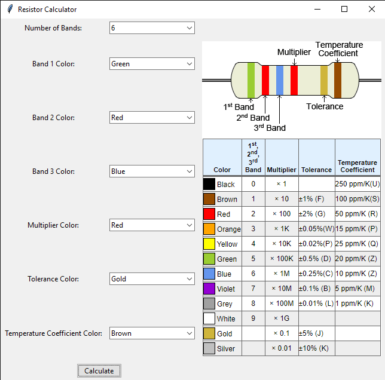
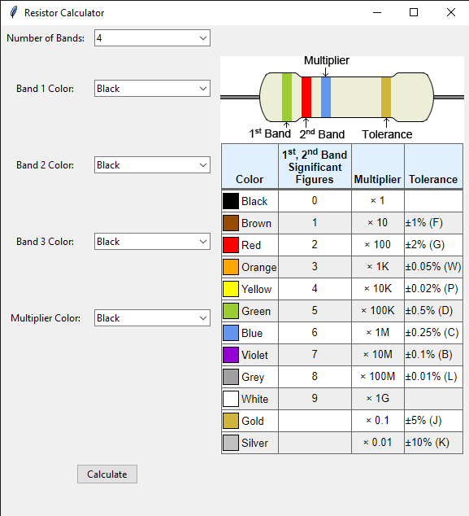

# Resistor Calculator

This is a Python application built using Tkinter that helps users calculate the resistance of resistors based on their color bands. It supports resistors with 3 to 6 color bands.

## Features

- **Color Band Selection**: Users can select the colors of the bands on the resistor using dropdown menus.
- **Automatic Image Update**: The application dynamically updates the resistor image based on the number of bands selected.
- **Resistance Calculation**: Upon clicking the "Calculate" button, the application calculates the resistance value of the resistor based on the selected color bands and displays the result.
- **Tolerance Display**: The application also displays the tolerance value of the resistor.
- **Support for Special Cases**: It handles special cases such as Gold and Silver bands for multipliers.

## Usage

1. **Select Number of Bands**: Choose the number of color bands on the resistor using the dropdown menu.
2. **Select Band Colors**: Select the color of each band using the dropdown menus provided.
3. **Calculate Resistance**: Click on the "Calculate" button to calculate the resistance value of the resistor.
4. **View Result**: The calculated resistance value along with the tolerance percentage is displayed.

## How to Run

1. Make sure you have Python installed on your system.
2. Install the required dependencies using pip:

    ```bash
    pip install Pillow
    ```

3. Clone this repository:

    ```bash
    git clone https://github.com/atillaasghari/resistor-calculator.git
    ```

4. Navigate to the project directory:

    ```bash
    cd resistor-calculator
    ```

5. Run the script:

    ```bash
    python resistor_calculator.py
    ```

## Screenshots





## Credits

- **Tkinter**: Used for building the GUI.
- **Pillow**: Used for image processing.

## License

This project is licensed under the MIT License - see the [LICENSE](LICENSE) file for details.
